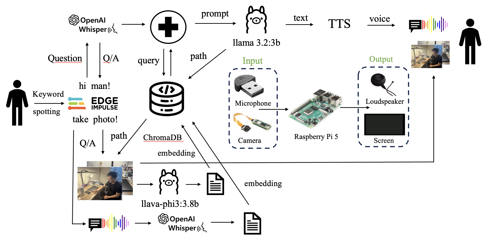

# Memory Recover

**Group 15 – Yonghao Lin · Zhenqi Li · Yang Cao**

Memory Recover is a lightweight, privacy-preserving memory assistant that **listens**, **remembers**, and **reasons** entirely on-device. Running on a Raspberry Pi 5, it helps users recall moments (e.g. *“Where did I leave my phone?”*) without sending any audio or images to the cloud.

This is our demo video: [🎥 Click here to see our video](https://www.youtube.com/watch?v=puY44id-oYs&t=336s)

---

## Why Memory Recover?

| Problem | Our Solution |
|---------|--------------|
| **Memory decline** – harder to recall events or item locations | Keyword-triggered snapshots + local retrieval |
| **Forgotten items** – everyday objects misplaced | Multimodal retrieval-augmented generation (RAG) answers “where/when” queries |
| **Privacy concerns** – cloud services risk data leaks | All processing (audio, vision, LLM, vector DB) runs locally |

---

## System Overview



### 1 · Keyword Spotting  
Edge Impulse models (we have 2 models) detect the following classes:  
- `hi man` · `take photo` · `unknown` · `noise`  
- `yes` · `no` · `unknown` · `noise`  
These wake the pipeline only when needed.

### 2 · “Take Photo” Flow  
1. Capture image → save to **`memory_images/`**  
2. User voice note → Whisper → text  
3. *Optional* **VLM caption** using `llava-phi3:3.8b` (a lightweight vision-language model)  
4. Both descriptions (user + VLM) → embeddings → **ChromaDB** for local memory storage  

> The use of `llava-phi3:3.8b` enables the system to understand image content and enrich memory entries, all while running locally on the Pi 5.

### 3 · “Hi Man” Query Flow  
1. The user speaks a question (e.g., “Where did I last see my phone?”)  
2. The system converts the question into a vector and performs a semantic search in ChromaDB  
3. It retrieves top-k relevant memory entries (user notes + model captions)  
4. These retrieved memories and the original question are sent to the LLM (`llama3.2:3b`) using a structured prompt  
5. The LLM reasons over the input to generate a natural-language answer and returns any referenced image paths  
6. The answer is spoken aloud, and related images are shown on screen

---

## Quick Start

> Tested on **Raspberry Pi 5** · 8 GB RAM · Python 3.11.2

```bash
git clone https://github.com/zl3508/Memory-Recover.git
cd memory-recover
source ~/ollama/bin/activate

# Core dependencies
pip install edge-impulse-linux

# Start Ollama and pull the models
ollama serve &
ollama pull llama3.2:3b
ollama pull llava-phi3:3.8b

python mainthread.py
```

> **Tip:** set `DISPLAY=:0` for GUI pop-ups if using HDMI or VNC.

---

## Voice Commands

| Command       | Action |
|---------------|--------|
| **take photo** | Snapshot → record description → (optional) VLM processing |
| **hi man**     | Ask any memory question (e.g. “Where was my wallet yesterday?”) |
| **yes / no**   | Confirmation for re-recording or VLM captioning |

---

## Directory Layout

```
memory-recover/
├─ mainthread.py          # entry point (interactive loop)
├─ camera_capture.py
├─ image_processing.py    # VLM captions
├─ vector_store.py        # ChromaDB helpers
├─ query_reasoning.py     # LLM prompts / answer object
├─ voice_interface.py     # Text-to-Speech and Speech-to-Text
├─ wake_word_listener.py  # Keyword spotting
├─ memory_images/         # captured JPGs
├─ chroma_db/             # persisted vectors
├─ memory_text_user.json  # user notes
└─ memory_text_model.json # VLM captions
```

---